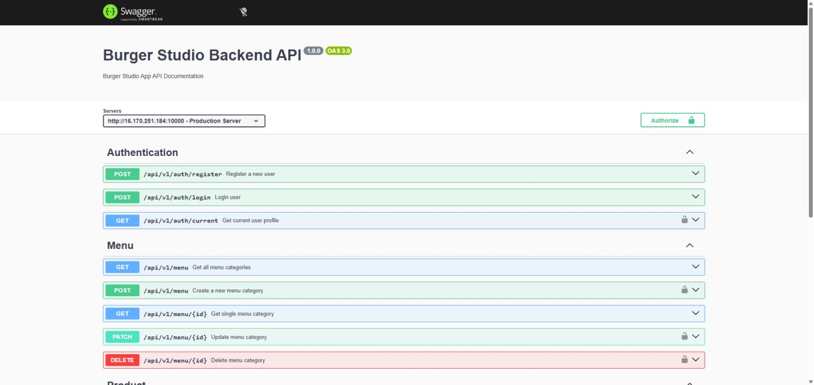

# 🛠️ Burger Studio API

<div align="center">
  
  <br />
  <p>
    <strong>Scalable Backend Architecture for Food Ordering Platform</strong>
  </p>
  <a href="https://backend-burgerstudio.onrender.com/api-docs/">🚀 Swagger Documentation</a> •
  <a href="https://github.com/Tanju67/frontend-burgerStudio">📂 frontend repo</a>
</div>

---

## 📝 Overview

**Burger Studio API** is a robust, scalable backend application built with Node.js and TypeScript. It powers the entire food ordering ecosystem by handling complex authentication, multi-role authorization, product management, and order workflows. Designed with the **MVC (Model-View-Controller)** pattern, it ensures a high degree of maintainability and security.

---

## ✨ Key Features

- 🏗️ **Architectural Excellence:** Clean separation of concerns using the MVC pattern.
- 🔐 **Advanced Auth:** Secure JWT-based authentication system.
- 🛡️ **RBAC (Role-Based Access Control):** Granular permissions for Admin, Demo Admin, and Authenticated Users.
- 📜 **API Documentation:** Interactive documentation powered by **Swagger**.
- 🛠️ **Data Integrity:** Strict request validation using **Zod** and schema modeling with **Mongoose**.
- 🖼️ **Media Management:** Image optimization with **Sharp** and cloud storage via **Cloudinary**.
- 🚨 **Centralized Error Handling:** Global middleware for consistent error responses across all endpoints.

---

## 🛠 Tech Stack

### Core Technologies


### Database & Storage


### Security & Utilities


---

## 🧠 Architecture & Challenges

### Flexible Authorization System

Designing a system that supports multiple roles (Admin, Test Admin, User, Guest) was a significant challenge. I addressed this by creating reusable **Authentication and Authorization middleware**. This allows for declarative route protection, ensuring that different endpoints have the correct access levels throughout the API.

### Scalability through MVC

To prevent the "Spaghetti Code" phenomenon as the project grows, I strictly followed the **MVC pattern**. By separating business logic (Services), request handling (Controllers), and data definitions (Models), the codebase remains organized, readable, and easy to scale.

### Image Optimization

Handling media uploads efficiently was crucial. I integrated **Sharp** to process and compress images before storing them in **Cloudinary**, significantly reducing bandwidth usage and improving frontend loading times.

---

## 💡 What I Learned

Building this API deepened my expertise in server-side development, specifically regarding **middleware design** and **API security**. Implementing TypeScript on the backend was a game-changer, providing type safety across the database and request layers, which significantly reduced runtime errors and improved the developer experience.

---

## ⚙️ Getting Started

### 1. Clone repositories

```bash
git clone https://github.com/Tanju67/backend-burgerStudio.git
git clone https://github.com/Tanju67/frontend-burgerStudio.git
```

### 2. Install dependencies

```bash
cd backend-burgerStudio
npm install

cd ../frontend-burgerStudio
npm install
```

### 3. Create .env file in backend and write your variable

```bash
MONGO_URI=(your value)
JWT_SECRET=(your value)
JWT_LIFETIME=(your value)
CLOUD_NAME=(your value)
API_KEY=(your value)
API_SECRET=(your value)
PORT=5000

```

### 4. Run the project

```bash
# backend
cd backend-burgerStudio
npm run dev

# frontend
cd frontend-burgerStudio
npm run dev
```

---

## 📄 License

MIT
